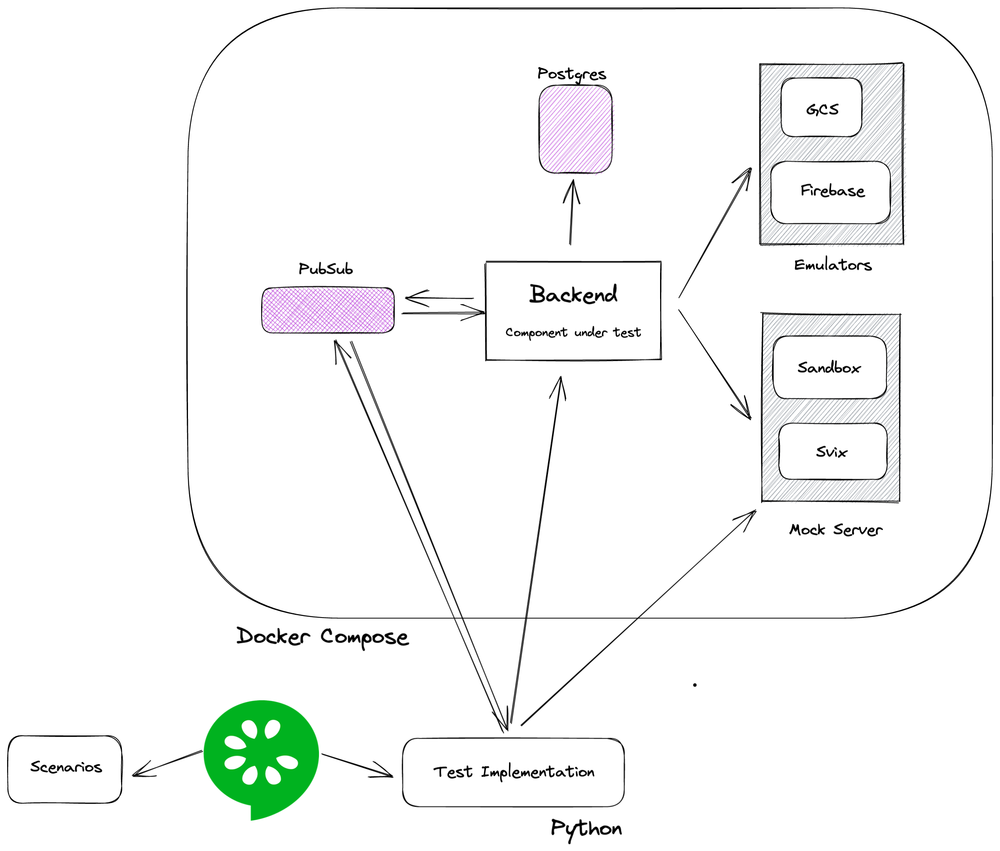

# Reducing feedback cycles 
## with BDD component tests

---


---

In the software development process, **slow feedback** is a multi-headed monster because at each of the aforementioned steps, you **could get feedback**.


---

Executable specifications can give you the **rapid feedback** you need to avoid wasting time on building software you **don’t need**, or software that **does not work**.

---

# Why executable?

* This means that on the one hand, you have a **human-readable specification** of what the system — or a particular change within the system — should do
* On the other hand, you have a suite of automated tests that a software engineer can run to verify that everything works as expected.

---

# BDD

or Behavior Driven Development

---

# What is a behavior?

**A behavior is how a product or feature operates.** It is defined as a scenario of inputs, actions, and outcomes.

---

# Examples

* Logging into a web page
* Clicking links on a navigation bar
* Submitting forms
* Making successful service calls
* Receiving expected errors

---

# Gherkin

1. **Given** some initial state
2. **When** an action is taken
3. **Then** verify an outcome

---


---

# Writing good Gherkin

* One scenario one behavior
* Avoid procedure driven functional tests

---

```gherkin
# BAD EXAMPLE! Do not copy.
Feature: Google Searching

  Scenario: Google Image search shows pictures
    Given the user opens a web browser
    And the user navigates to "https://www.google.com/"
    When the user enters "panda" into the search bar
    Then links related to "panda" are shown on the results page
    When the user clicks on the "Images" link at the top of the results page
    Then images related to "panda" are shown on the results page
```

---

```gherkin
Feature: Google Searching

  Scenario: Search from the search bar
    Given a web browser is at the Google home page
    When the user enters "panda" into the search bar
    Then links related to "panda" are shown on the results page

  Scenario: Image search
    Given Google search results for "panda" are shown
    When the user clicks on the "Images" link at the top of the results page
    Then images related to "panda" are shown on the results page
```

---

The Cardinal Rule of BDD: One Scenario, One Behavior!

---

# Phrasing steps

* Write all steps in third-person point of view.
* Write steps as a subject-predicate action phrase.

---

```gherkin
# BAD EXAMPLE! Do not copy.
Feature: Google Searching

  Scenario: Simple Google search
    Given the user navigates to the Google home page
    When the user entered "panda" at the search bar
    Then links related to "panda" will be shown on the results page
```

---

```gherkin
Feature: Google Searching

  Scenario: Simple Google search
    Given the Google home page is displayed
    When the user enters "panda" into the search bar
    Then links related to "panda" are shown on the results page
```

---

# Choosing the right details

```gherkin
# BAD EXAMPLE! Do not copy.
Feature: Hot Start

  Scenario: Running an always hot pool
    Given the following tracks
        | id | slug | title | description | ...
        | XX | xxx  | XXX   | XXX..       |
```

---

# Choosing the right details

```gherkin
Feature: Hot Start

  Scenario: Running an always hot pool
    Given a track with slug example-a
    When the user creates an always hot pool for track example-a
```

---

# Technical implementation

## The boring part

---



---

# FaQ

* Does this replace manual testing?
* Why not do e2e testing?
* Why write test implementations in Python (and not in Go)?

---

# Workshop (part 1)

```gherkin
Scenario: Scheduling a pool in the future does not start any sandboxes

Scenario: A scheduled pool spins up sandboxes after the start at time has elapsed

Scenario: It is not allowed to update the type of a pool after creation
```

---

# Workshop (part 2)

```gherkin
Scenario: Starting a track which has a pooled instance available results in claiming the instance

Scenario: Starting a track which has no pooled instances available results in the creation of a new sandbox
```

---

# Resources

* https://behave.readthedocs.io/en/stable/philosophy.html
* https://automationpanda.com/bdd/
* [Specification by Example](https://www.amazon.nl/Adzic-Specification-Example-Successful-Software/dp/1617290084)