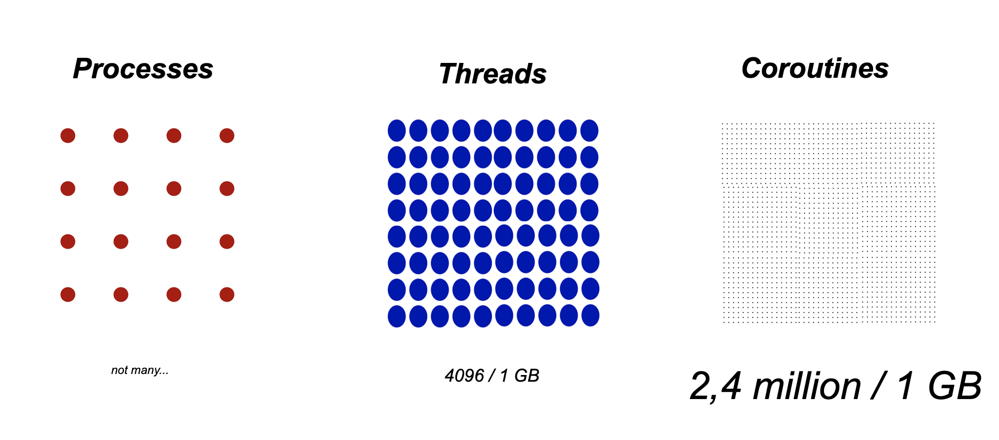

# Asynchronous Programming & Kotlin Coroutines

---

## Why Asynchronous Programming?

---

The Operating System is synchronous.

---

Every system call parks a Thread and waits for some action to complete before it unparks the thread and continues computation.

---

To perform multiple operations at the same time we can use different processes. 

So one process can be waiting for a system call, while another can leverage the CPU to compute.

But a process is a **heavy** abstraction.

---

This is where threads come in, the operation system can start multiple computations at the same time within a single process through threads. 

Threads are **cheaper** than processes, and they allow two separate threads to block at the same time.


---

Modern applications need to perform lots of tasks concurrently. So giving each task a thread is not scalable. What if we could perform system calls without taking up an entire thread, but instead pass the thread on to another task until our system call has finished.

This is what we call asynchronous programming.

---

[.build-lists: true]

## Different styles of Asynchronous Programming

* Callbacks
* Futures / Promises
* Suspending functions

---

# Callbacks

```kotlin
fun findProductByName(title: String, cb: (String) -> Unit) {
    client.get("/api/product?name={name}") { response -> cb(response.json().get("name")) }
}
```

---

# 🔥Callback Hell 🔥

```kotlin
fun findProductByName(title: String, cb: (String) -> Unit) {
    client.get("/api/product?name={name}") { response -> 
        client.get("/api/product/{(response.json().get("id"))}") { product -> 
            cb.apply(product)
        } 
    }
}
```

---

# Future / Promises

* Help with composition of multiple asynchronous operations
* Many different libraries on the JVM:
    * Standard library has CompletableFuture
    * Reactiv libraries: RxJava, Reactor, Akka Streams

---

# Future / Promises

[.code-highlight: all]
[.code-highlight: 3]
[.code-highlight: 4]

```kotlin
fun findProductByName(name: String): CompletableFuture<String> {
    client.get("/api/product?name={name}")
        .thenCompose { id -> client.get("/api/product/{id}") }
        .thenApply { product -> product.get("name") }
}
```

---

# 🌴 Combinator Jungle 🌴


---

## Kotlin Suspend

---

## Kotlin Suspend

[.code-highlight: all]
[.code-highlight: 1]

```kotlin
suspend fun findProductByName(name: String) {
    val response = client.get("/api/product?name={name}")
    val product = client.get("/api/product/{response.get("id")}")
    return product
}
```

---


---

At it's heard **suspend** methods are about returning from a method and later re-entering, without losing it's scope.

This is not something 'normal' methods in Java allow us to do.

We can return once, and there is no way to re-enter the method at a later stage.

---

## Suspend Functions Under the Hood

[.code-highlight: none]
[.code-highlight: 1]
[.code-highlight: 3]
[.code-highlight: 5-9]

```kotlin
suspend fun delay(timeMillis: long): Unit

suspend fun delay(timeMillis: long, callback: Continuation<Unit>): Unit

interface Continuation<in T> {
  val context: CoroutineContext
  fun resume(value: T)
  fun resumeWithException(exception: Throwable)
}
```

---

## Suspend Functions Under the Hood

Suspend functions use callbacks under the hood. This is why Kotlin can run on the JVM, it uses the same concurrency primitive available to Java.

---

## From Suspend to Coroutine

---

[.column]

# Threads

```kotlin
thread {
    sleep(500)
    println("Rabbit")
}
println("Turtle")
thread.join()
```

[.column]

# Coroutines

```kotlin
runBlocking {
    launch {
        delay(500)
        println("Rabbit")
    }
    println("Turtle")
}
```

---



---