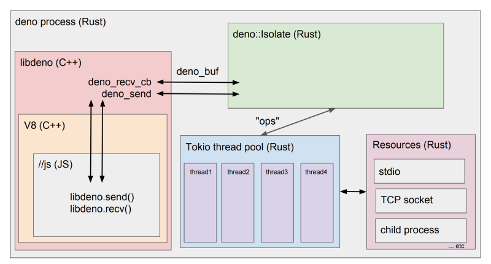
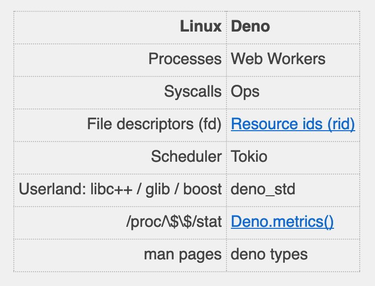

footer: Deno - Matthisk
slidenumbers: true

# Deno


---

Deno is a new command-line runtime for executing **JavaScript** and **TypeScript**. Created by the creator of Node, *Ryan Dahl*

---

## Disclaimer

Deno is very much **under development**. We encourage brave *early adopters*, but expect *bugs* large and small. The API is **subject to change** without notice.

---

Build on top of:

* V8
* Rust
* Tokio (event loop)
* TypeScript

---

# Why

---

The JavaScript ecosystem has significantly changed since the inception of Node. Notably:

* Promises / Async / Await
* ES modules
* Typed Arrays

---

## Problems with the design of Node

* Poorly designed module system, with centralized distribution
* Lots of legacy APIs that must be supported
* (in)-Security

---

# How

---

**ES modules** are the one and only module system

- HTTP URLs are used to link to third party code
- Deno fetches resources itself, no need for a package manager

---

Deno is **secure** by default
  
- Users must give extra permission to access the disk, network, or perform other privileged operations.

--- 

Deno maintains **browser compatibility**
  
- The subset of Deno programs which are written completely in JavaScript and do not use the global Deno namespace, ought to also be able to be run in a modern web browser without change.

---

## Deno demo: REPL and types

```bash
deno -h
```

```bash
deno types
```

---

## Deno demo: cat program

---

## cat program

* Escaping the sandbox requires perimssion
* Deno code looks quite different from Node

---

## Deno demo: TCP server

---

## TCP server

* std library is built around uint8 arrays

---

## Deno demo: HTTP server

---

## HTTP server

* Deno can download files
* HTTP server is part of standard library
  - [https://github.com/denoland/deno_std/blob/master/http/server.ts#L383](https://github.com/denoland/deno_std/blob/master/http/server.ts#L383)
* Deno compiles TypeScript for you

---

## Deno package management

* ES modules compatible (runs in browsers)
* Modules are cached (`$HOME/Library/Caches/deno/deps`)
* User modules: [https://deno.land/x/](https://deno.land/x/)

---

## Deno package management

* But what if [https://deno.land/](https://deno.land/) goes down? 

<!-- Relying on external servers is convenient for development but brittle in production. Production software should always bundle its dependencies. In Deno this is done by checking the $DENO_DIR into your source control system, and specifying that path as the $DENO_DIR environmental variable at runtime. -->

* How do you import to a specific version? 

<!-- Simply specify the version in the URL. For example, this URL fully specifies the code being run: https://unpkg.com/liltest@0.0.5/dist/liltest.js. Combined with the aforementioned technique of setting $DENO_DIR in production to stored code, one can fully specify the exact code being run, and execute the code without network access. -->

* It seems unwieldy to import URLs everywhere. What if one of the URLs links to a subtly different version of a library? 

<!-- Isn't it error prone to maintain URLs everywhere in a large project? The solution is to import and re-export your external libraries in a central deps.ts file (which serves the same purpose as Node's package.json file). For example, let's say you were using the above testing library across a large project. Rather than importing "https://deno.land/std/testing/mod.ts" everywhere, you could create a deps.ts file the exports the third-party code: -->

---

## Deno architecture



---

## Deno as an OS



---

# Embedding Deno

* Executing in Node is insecure (disk / network can be accessed)
* Using raw V8 is complicated

Use cases:

* Databases executing JavaScript for map/reduce
* Serverless edge computing

---

# Deno std library

* Minimal set of high quality standard modules
* Separate from the main distributable
* No external dependencies
* Reviewed by Ryan Dahl

---

## Benchmarks

* [https://deno.land/benchmarks.html#req-per-sec](https://deno.land/benchmarks.html#req-per-sec)

---

## Interesting take-aways

* Aiming for 1.0 release this summer
* Think of Deno more in terms of an OS / sandbox, rather than a scripting runtime
* Includes minimal set of high quality standard modules
* Deno is its own package manager
* Heavily inspired by Golang
  - the std library is a loose port of Go's std library
