slide-transition: true

<!--
This talk will look at what Event Sourcing is, when it may be valuable (more importantly when its not), and how problems can change when looked at through a different lens. There are many trade offs, misconceptions, and of course FUD associated around Event Sourcing, hopefully we can sort some of them out.
-->

# Event Sourcing 
### And when you should**n't**


--- 

[.build-lists: true]

* Who has **heard** of event sourcing
* Who has **applied** event sourcing?

---

[.build-lists: true]

* Creating software, requires a **model** of **reality**.
* A **model** requires a trade-off, we represent a **simplified** reality.
* Usefulness of a **model** is specific to a particular **scenario**

---


---


---

[.build-lists: true]

* How do we model **state** in our application?
* **State** is represented as a **snapshot**.
* But in the real world the **present** is the sum of everything that has happened before
  * A bookshelf is the sum of all the books added to the shelf, and the ones removed.
  * My basket in a store is the sum of all items added to it while walking through the store.

---

[.build-lists: true]

* In many models this **simplification** of reality is fine.
* The same as our **mercator projection**, is **fine** for a map used to travel the seas.
* But what if a **domain** shouldn't be represented as a **snapshot**

---


---

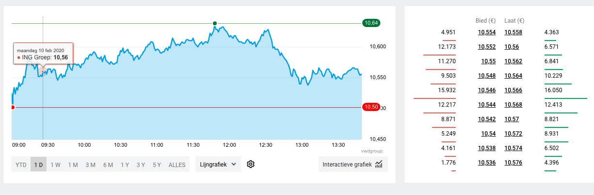

---


---


---

[.build-lists: true]

* In a domain where modelling state as a **snapshot** is not a useful **simplification**.
* We can rely on an architectural pattern called **event sourcing**

---

[.build-lists: true]

# What is event sourcing?

**Event sourcing** is the architectural pattern where the **full history** of the domain is persisted as a **sequence of facts** (or events). Rather than persisting just the current state.

<!-- In Event Sourcing all state is transient and you only store facts. -->

---

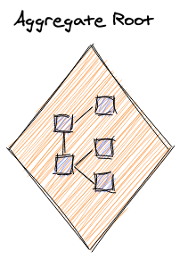

---

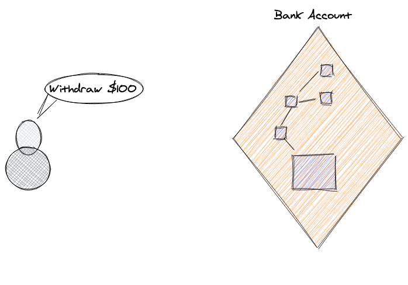

---

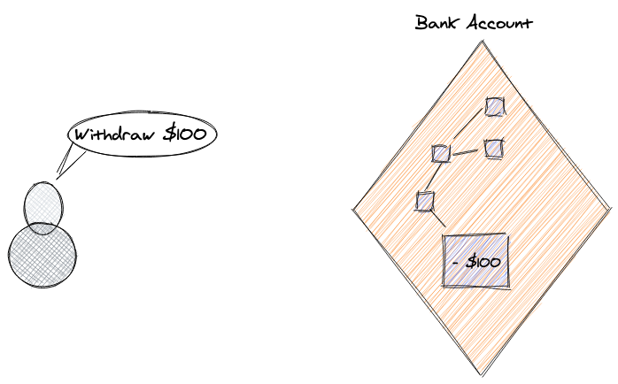

---


---

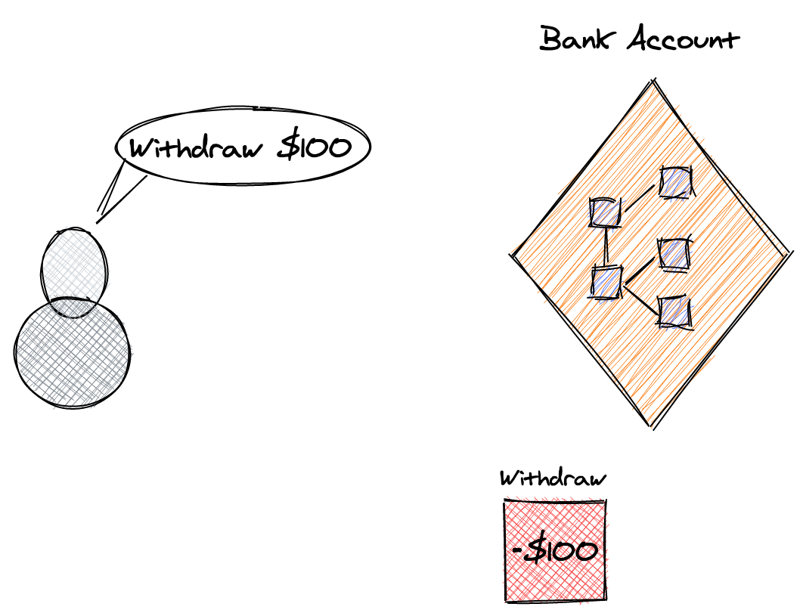

---

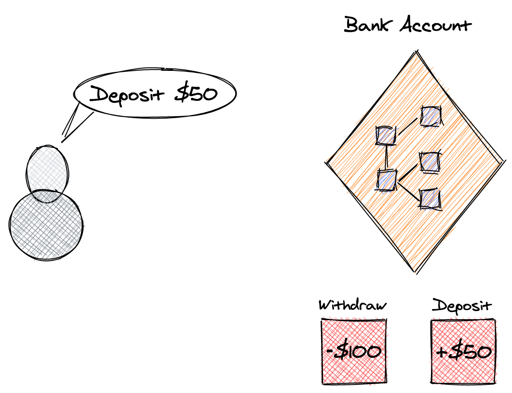

---

* Audit Trail

---

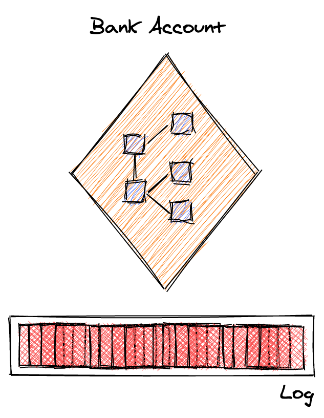

---

```java
var currentState = events.fold(aggregator, emptyState)
```

---

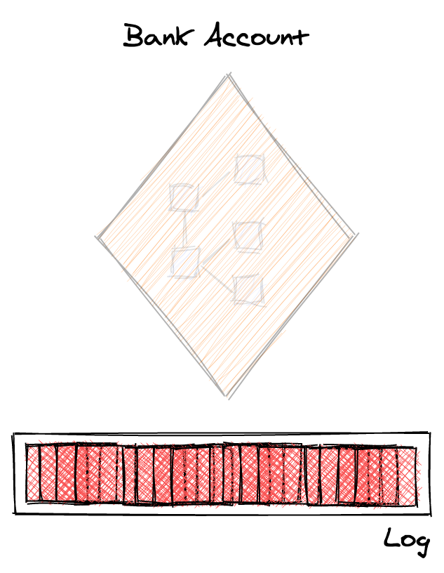

---

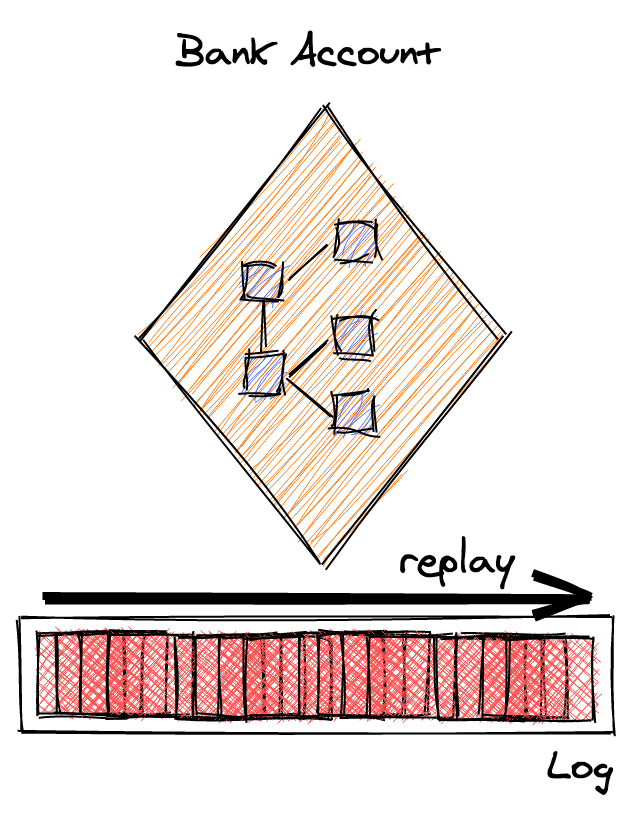

---

* Audit Trail
* Debugging

---


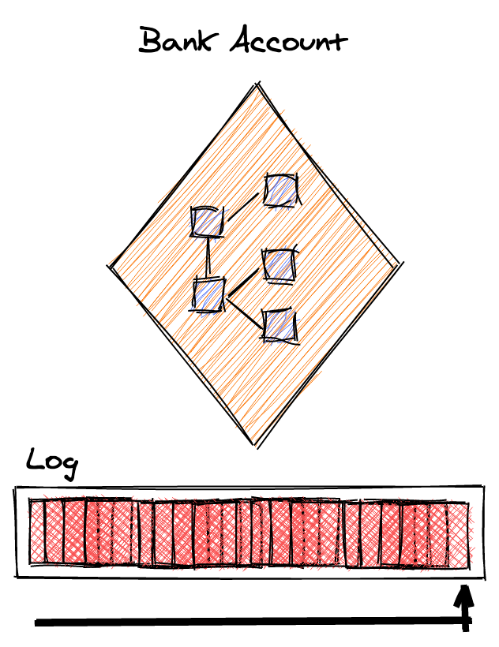

---

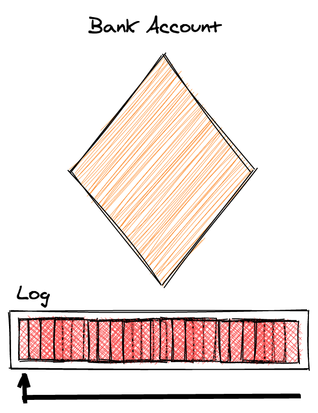

---

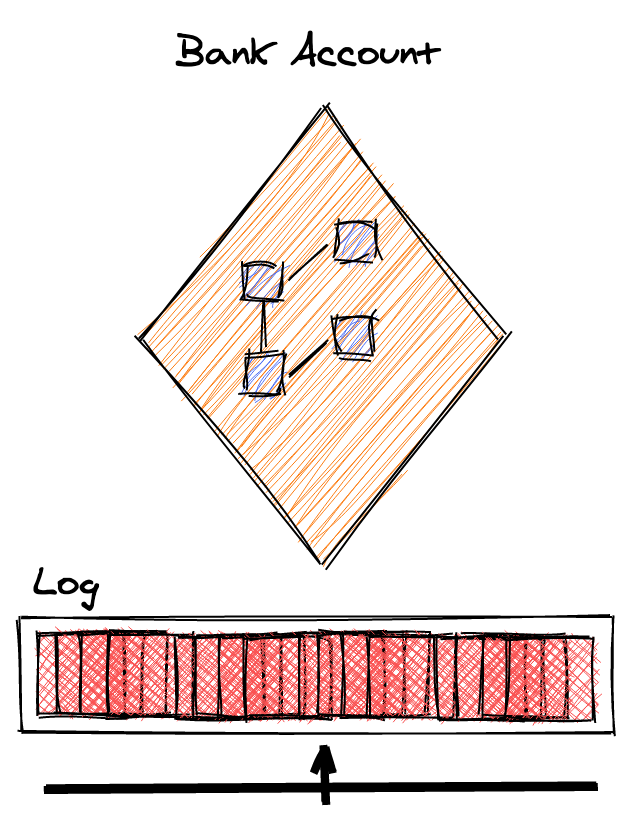

---

* Audit Trail
* Debugging
* Historic State

---


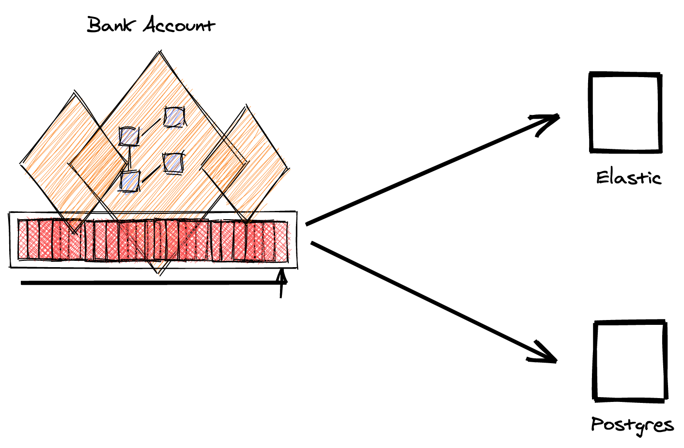

---

* Audit Trail
* Debugging
* Historic State
* Read models

---


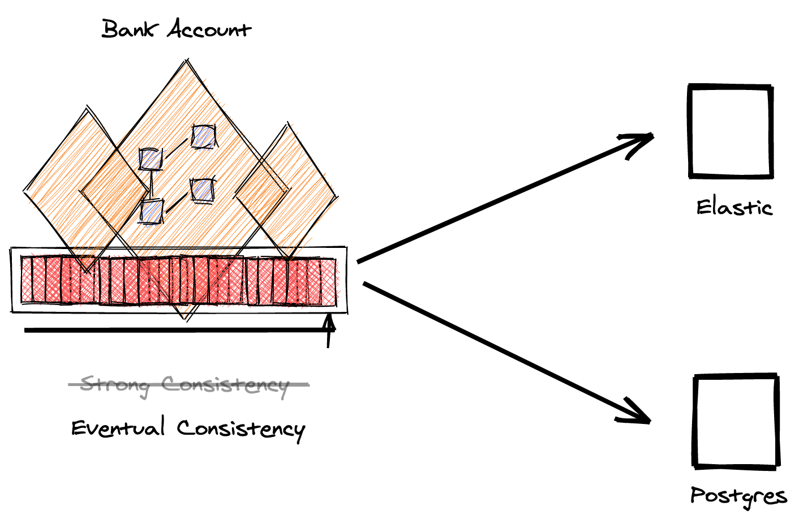

---

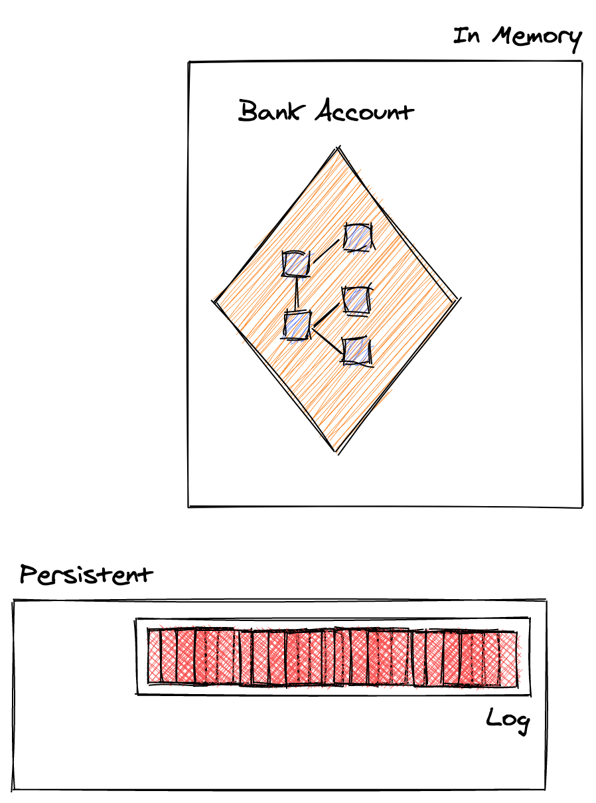

---

* Audit Trail
* Debugging
* Historic State
* Read models
* In memory processing

---

[.build-lists: true]

# Common mistakes

* Confusing the need for **one** technical capability of the pattern, for needing the pattern.
* Building your own **event sourcing** solution! 👎
* Mistaking event sourcing for **event driven architectures**.

---

### Event Sourcing vs. Event Driven Architecture

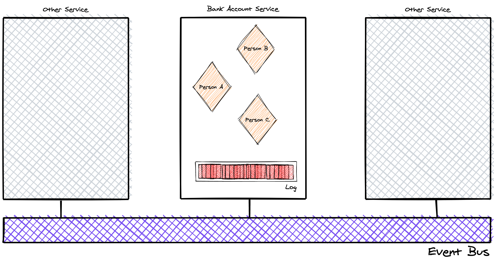

---

# Common mistakes

* Confusing the need for **one** technical capability of the pattern, for needing the pattern.
* Building your own **event sourcing** solution! 👎
* Mistaking event sourcing for **event driven architectures**.
* Event Sourcing is about **business events**, which model the real world. Not **technical events** only relevant to the implementation.

---


# 🙅 Event Sourcing, when you should**n't**

* We want to apply a **hip** architectural pattern.
* We need an **audit trail**
* For **performance**

---

[.build-lists: true]

# 🙋 Event Sourcing, when you should

* When your model needs to represent a **temporal domain**.
* When you are building your own **database**
* When you are building your own **version control system**
