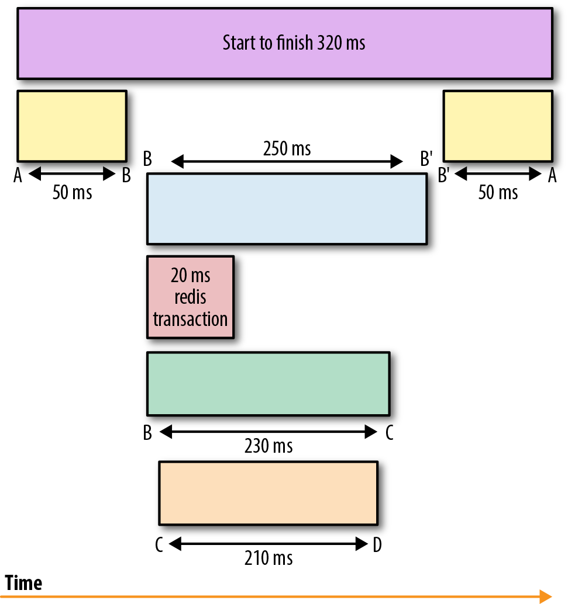

footer: m@tthisk.nl
slidenumbers: true

# Distributed System Observability

---

## Three pillars of observability[^1]

* Logs
* Metrics
* Traces 

[^1]: https://www.oreilly.com/library/view/distributed-systems-observability/9781492033431/ch04.html

---

## Blindspots

---

[.build-lists: true]

* Our logging is too verbose and unstructered
* No metrics from the application runtime
* No intel across system boundaries

---

[.build-lists: true]

* Our logging is too verbose and unstructered
* No metrics from the application runtime
* **No intel across system boundaries**

---

## Distributed tracing

---

Distributed tracing is a technique that addresses the problem of bringing visibility into the **lifetime of a request** across several systems. [^2]

[^2]: https://www.oreilly.com/library/view/distributed-systems-observability/9781492033431/ch04.html

---

---

## Technology

* Java integration to capture spans
* Service to aggregate spans

---

## Technology

* Java integration to capture spans: **Opencensus**
* Service to aggregate spans: **Stackdriver**

---

## Opencensus vs. OpenTracing

* OpenTracing is a standardized API for tracing
* OpenCensus is a collection of language-specific libraries for instrumenting an application

---

## Demo

---

## Won't the service mesh solve all our problems?

* Main selling point is usecase for polyglot services
* Still requires application code to propagate context
* Will work seamlessly with current setup [^3]

[^3]: https://www.youtube.com/watch?v=ME-EhOKqFOY

---

## How to get this in production

* Integrate with the StackDriver exporter
* Reassure that there is no performance penalty
* Deploy to production
* propagate context

---