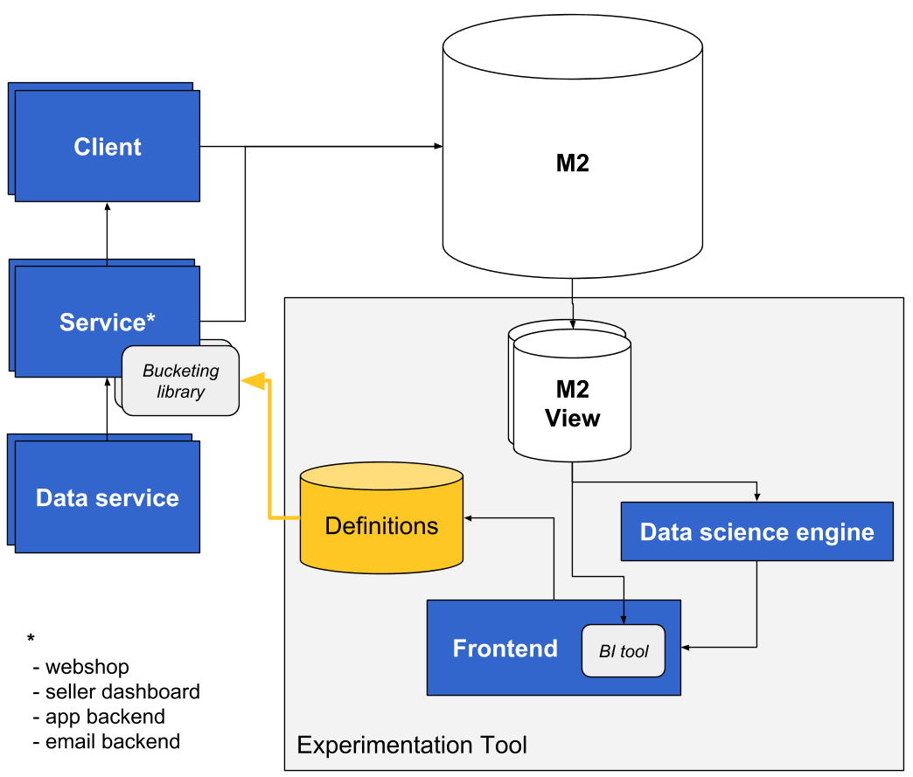

# [fit] Experimentation at *bol.com*

---

<!-- maybe drop these two slides and just ask on the first slide on building custom experimentation tooling -->

### Who ran **experiments** at their client

---

### What **tools** did you use to run **experiments**

---

# [fit] **Let's talk** *bol.com*

---

# [fit] *Bol.com* is e-commerce at
# [fit] **serious scale**

^ 2 billion in revenue
16 million products in their catalogue
Operating since 1999, 1500 employees, 70 engineering teams, 2 billion in revenue, 50% of revenue generated by resellers

---

# [fit] *Bol.com* is much more than a **webshop**

^ Running warehouse, running on multi multi platforms (mobile, voice)
Platform for (22.000) resellers, affiliates, marketeers etc.

---

# [fit] *bol.com* is **not** an **engineering** company

^ retail business first, e-commerce second
bol.com's business is still strictily divided from their it teams. 
bol.com is not running on fancy new technology, i.e. jboss on atg
monolithic backend for frontend webshop

---

# [fit] Building a custom experimentation tool

---

[.build-lists: true]

## Why re-invent the wheel?

* Use inhouse data solution
* Scaling will become an issue
* Advanced functionality (*multi armed bandit*)

^ All major tech companies use inhouse experimentation tooling (e.g. Booking, ING, Marktplaats)

---

## Requirements

* 70 teams
* Experimentation across the stack
* Experimentation across the platform
* Shifting Bol.com's culture to be experimentation first

<!--* Future: resellers can experiment-->

---

## 3 Facets

* Tooling
* Knowledge Sharing
* Analysis

^ tooling (create experiment, start / stop experiment, experiment library, BI)
Analyzing (depict runtime, rpovide kpi's)
Knowledge sharing (library of previous experiments, list of all current ideas)

---

## Proposed solution

---

---

## Approach

1. MVP a/a test
2. hook up to backend
3. create tooling (frontend)
4. wire up the statistics engine

---

## Technologies

* Kotlin experimentation client library
* Murmur hash based bucketing algorithm
* Spring boot based experimentation service
* React based frontend

---

# [fit] What did we learn in our first month

---

# Acronym all the things 🤬

AIR, APL, AUT, BIZCAT, BLUE, BJN, BOQS, BUBBA, CDN, CDS, CHK, CMT, CP, CNTR, COPS, CTN, CCM, DQS, DCS, DVN, DGF, DISCO, DTR, DPI, DUX, EDDY, EST, FFT, FPC, FRK, GCD, GOPRO, GRM, GSE, HDL, HTD, ICN, IPL, MXS, MAF, MESS, OER, OLG, OPERA, ORCA, PAS, PRK, PCT, POS, PRC, PCS, DARWIN, PYT, RED, ROS, ROSLING, RTP, SCAR, SEO, SFD, SOR, SSO, SLT, SNAIL, SQRL, SUMMA, SSY, SWAP, SWAPS, TEAM1B, DPIT, TLT, TOM, TRC, WSP, WIKI

---

# [fit] Don't swim against the current

^ we had to drop our longing to use state of the art cloud tech, to make sure our solution can be maintained and improved by the bol.com engineers

---

[.build-lists: true]

## What were we able to achieve in 1 month

* Extended contracts
* First production release
* Claim autonomy for architectural decisions

---

