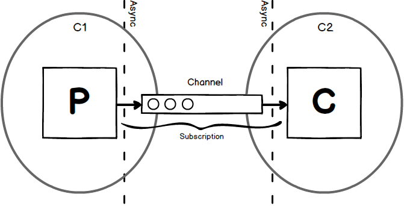

slidenumbers: true
footer: matthisk.com

### Elegant reactive streams with coroutines


---


^ To get a sense of the crowd
- Who knows the kotlin syntax?
- Who has worked with coroutines?

---

# Coroutines

Coroutines are **light-weight threads**, that allow us to _yield_ and _reenter_ methods

```kotlin
 suspend fun enterExit() {
     println("hello")
🌱   delay(500) // suspend
     println("world") // re-enter
 }
```

---

# Using Coroutines

```kotlin
suspend fun foo(): Response
```

```kotlin
suspend fun foo(): List<Response>
```

---

```kotlin
fun foo(): Flow<String> = flow {
  // ...
}
```

---

```kotlin
fun foo(): Flow<String> = flow {
  emit("A")
  emit("B")
  emit("C")
}
```

---

```kotlin
fun strings(): Flow<String> = flow {
  emit("A")
  emit("B")
  emit("C")
}
```

```kotlin
fun main() = runBlocking {
  val flow = strings()
  foo.collect { x -> println(x) }
}
```

---

# Flows are cold ❄️

```kotlin
fun main() = runBlocking {
  val flow = strings()
  // foo.collect { x -> println(x) }
}
```

---

# Flows are declarative

```kotlin
fun strings(): Flow<String> = flowOf("A", "B", "C")
    .map { x -> compute(x) }
```

---

# Flows are declarative

```kotlin
// Declarative
fun strings(): Flow<String> = flowOf("A", "B", "C")
    .map { x -> compute(x) }
```

```kotlin
// Imperative
fun strings(): List<String> = listOf("A", "B", "C")
    .map { x -> compute(x) }
```

---

# Flows are sequential

[.build-lists: true]

```kotlin
fun main() = runBlocking {
  strings()
    .map { x -> compute(x) }
    .collect { x -> println(x) }
}
```

* A ➡ compute(A) ➡ print(A)
* B ➡ compute(B) ➡ print(B)
* C ➡ compute(C) ➡ print(C)

---

# Flows are sequential

[.build-lists: true]

```kotlin
fun main() = runBlocking {
  strings()
    .flatMap { x -> compute(x) }
    .collect { x -> println(x) }
}
```

* A ➡ compute(A) ➡ print(A); print(B)
* C ➡ compute(C) ➡ print(C); print(D)

---

# Flows do **not** implement backpressure

```kotlin
fun main() = runBlocking {
  fastProducer()
    .buffer(1024)
    .collect(slowConsumer)
}
```

---

## 🤯

---

## Why do we need **backpressure**?

---


^ Explain that streams are there to connect a producer of elements to a consumer 
of these elements.

---


^ In a synchronous world the producer can just look at the queue and decide whether 
to keep producing or to suspend producing because the queue is filled up. 

---


^ Now that the consumer is not allowed to block, there is no primitive (other than
callbacks) to limit the producer from overflowing the consumer.

---

In **Java** asynchronous concurrency is provided by **callbacks**

---

# Reactive Streams & Callbacks

```java
interface Publisher<T> {
    public void subscribe(Subscriber<? super T> subscriber);
}
```

---

# Reactive Streams & Callbacks

```java
interface Publisher<T> {
    public void subscribe(Subscriber<? super T> subscriber);
}
```

```java
interface Subscriber<T> {
    public void onNext(T item);
}
```

---

# Reactive Streams & Callbacks

```java
interface Publisher<T> {
    public void subscribe(Subscriber<? super T> subscriber);
}
```

```java
interface Subscriber<T> {
    public void onNext(T item);
}
```

```java
interface Subscription {
    public void request(long n);
}
```

---

In **Kotlin** asynchronous concurrency is provided by **co-routines**

---

# Kotlin Flow

```kotlin
interface Flow<out T> {
    suspend fun collect(collector: FlowCollector<T>)
}
```

---

# Kotlin Flow

```kotlin
interface Flow<out T> {
    suspend fun collect(collector: FlowCollector<T>)
}

interface FlowCollector<in T> {
    suspend fun emit(value: T)
}
```

^ Collectors are multiplexed, if you receive a Collector you can use it to produce messages.
But if you supply a Collector it can be used to produce messages to you.

---


---

# Channels

A Channel is conceptually similar to `BlockingQueue`. Where instead of a **blocking** `put` it has a **suspending** `send`, and instead of a **blocking** `take` it has a **suspending** `receive`.

---



---

# Creating a Flow

```kotlin
fun <T> flow(block: suspend FlowCollector<T>.() -> Unit): Flow<T>
```

---

# Terminators

```kotlin
fun <A> Flow<A>.toList(destination: MutableList<T> = ArrayList()): List<A> = flow {
  collect {
    destination.add(it)
  }
  return destination
}
```

---

# Operators

```kotlin
fun <A, B> Flow<A>.map(transform: suspend (value: A) -> B) = flow {
    collect { 
        emit(
            transform(it)
        ) 
    }
}
```

---

# Operators

```kotlin
fun <A, B> Flow<A>.filter(predicate: suspend (value: A) -> Boolean) = flow {
    collect { 
        if (predicate(it)) {
          emit(
              transform(it)
          ) 
        }
    }
}
```

---

# Buffers

```kotlin
fun <A> Flow<A>.buffer(capacity: Int) = flow {
  val channel = Channel<A>(capacity)

  launch {
    collect {
      channel.send(it)
    }
  }

  channel.consumeEach { emit(it) }
}
```

---

# What have we learned

* Having to *account* for **backpressure** is **not** something inherent to async stream processing
* Poor concurrency primitives make for complexer application level code

---

# What about Java?

https://github.com/matthisk/java-flow

---

# References

* [blocking threads suspending coroutines](https://medium.com/@elizarov/blocking-threads-suspending-coroutines-d33e11bf4761)
* [kotlin flows and coroutines](https://medium.com/@elizarov/kotlin-flows-and-coroutines-256260fb3bdb#ea96)
* [simple design of kotlin flow](https://medium.com/@elizarov/simple-design-of-kotlin-flow-4725e7398c4c#9857)
* [cold flows hot channels](https://medium.com/@elizarov/cold-flows-hot-channels-d74769805f9)