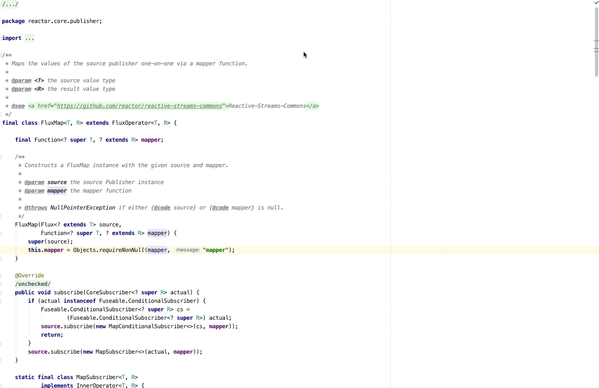
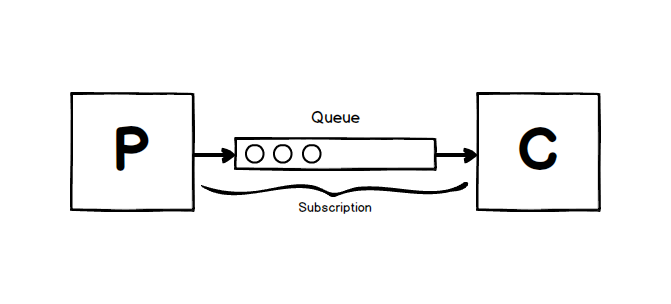
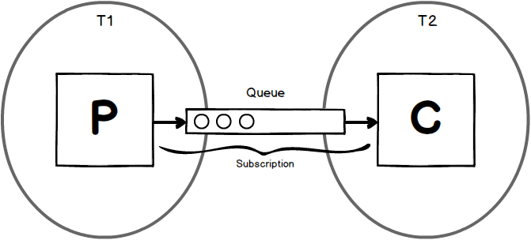
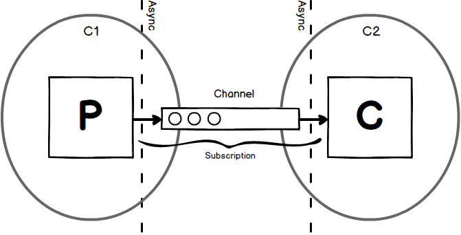

slidenumbers: true
footer: matthisk.com

# Elegant reactive streams with coroutines


---


^ To get a sense of the crowd
- Who knows the kotlin syntax?
- Who has worked with coroutines?

---

# Claim

> Reactive streams are __hard to implement__ and __error prone__ as a result of the __poor concurrency primitives__ provided by the JVM.

---

# Part 1: Theory


---

# Hard to implement

---

Backpressure



---

# Error prone[^1]

[^1]: https://medium.com/jeroen-rosenberg/10-pitfalls-in-reactive-programming-de5fe042dfc6

---

[.build-lists]

# Poor concurrency primitives

1. Threads
    * Expensive!!!
2. Callbacks
    * Backpressure

---

## Why do we need backpressure?

---



^ Explain that streams are there to connect a producer of elements to a consumer 
of these elements.

---



^ In a synchronous world the producer can just look at the queue and decide whether 
to keep producing or to suspend producing because the queue is filled up. 

---


^ Now that the consumer is not allowed to block, there is no primitive (other than
callbacks) to limit the producer from overflowing the consumer.

---

```java
    // Asynchronous Producer
Flux.create(emitter -> {
            emitter.next("hello");
            // <- How do we suspend our thread here??? ->
            emitter.next("world");
        })
    // Thread boundary
    .publishOn(Schedulers.elastic()) 
    // Consumer
    .subscribe(System.out::println); 
```

---

[.code-highlight: 4]

```java
    // Asynchronous Producer
Flux.create(emitter -> {
            emitter.next("hello");
            // <- How do we suspend our thread here??? ->
            emitter.next("world");
        })
    // Thread boundary
    .publishOn(Schedulers.elastic()) 
    // Consumer
    .subscribe(System.out::println); 
```

---

What if there existed a **concurrency primitive** that allowed us to implement a queue on which operations **do not block**.

---

# Channels

---

# Channels

A Channel is conceptually similar to `BlockingQueue`. Where instead of a **blocking** `put` it has a **suspending** `send`, and instead of a **blocking** `take` it has a **suspending** `receive`.

---

## What are we **suspending** here?

---

# Coroutines

Coroutines are like **light-weight threads**, that allow us to _yield_ and _re-enter_ methods

```kotlin
suspend fun enterExit() {
    println("hello")
    delay(500) // suspend
    println("world") // re-enter
}
```

---



---

# Part 2: Kotlin Flow


---

# Kotlin Flow

```kotlin
interface Flow<out T> {
    suspend fun collect(collector: FlowCollector<T>)
}
```

---

# Kotlin Flow

```kotlin
interface Flow<out T> {
    suspend fun collect(collector: FlowCollector<T>)
}

interface FlowCollector<in T> {
    suspend fun emit(value: T)
}
```

^ Collectors are multiplexed, if you receive a Collector you can use it to produce messages.
But if you supply a Collector it can be used to produce messages to you.

---

# Creating a Flow

```kotlin
fun <T> flow(block: suspend FlowCollector<T>.() -> Unit): Flow<T>
```

---

# Creating a Flow

```kotlin
fun <T> flow(block: suspend FlowCollector<T>.() -> Unit): Flow<T>

fun main() = flow {
    emit("hello")
    delay(100) // 🎉 Suspend the producer without blocking 
    emit("world")
}
```

---

# Creating a Flux

```java
Flux.from(subscriber -> {
    subscriber.onSubscribe(new Subscription() {
        @Override
        public void request(long n) {
            // Send `n` items to `subscriber.onNext`
        }
    });
});
```

---

# Using a Flow

```kotlin
    // Asynchronous Producer
flow {
    emit("hello")
    // <- How do we suspend our coroutine here??? ->
    emit("world")
}
    // Thread boundary
    .flowOn(Dispatchers.IO)
    // Consumer
    .collect { println(it) } 
```

---

# Using a Flow

```kotlin
    // Asynchronous Producer
flow {
    emit("hello")
    delay(100)
    emit("world")
}
    // Thread boundary
    .flowOn(Dispatchers.IO)
    // Consumer
    .collect { println(it) } 
```

---

# Operators

```kotlin
fun <A, B> Flow<A>.map(transform: suspend (value: A) -> B) = flow {
    collect { 
        emit(
            transform(it)
        ) 
    }
}
```

---

# What have we learned

* Having to *account* for **backpressure** is **not** something inherent to async stream processing
* Poor concurrency primitives make for complexer application level code

---

# References

* [blocking threads suspending coroutines](https://medium.com/@elizarov/blocking-threads-suspending-coroutines-d33e11bf4761)
* [kotlin flows and coroutines](https://medium.com/@elizarov/kotlin-flows-and-coroutines-256260fb3bdb#ea96)
* [simple design of kotlin flow](https://medium.com/@elizarov/simple-design-of-kotlin-flow-4725e7398c4c#9857)
* [cold flows hot channels](https://medium.com/@elizarov/cold-flows-hot-channels-d74769805f9)