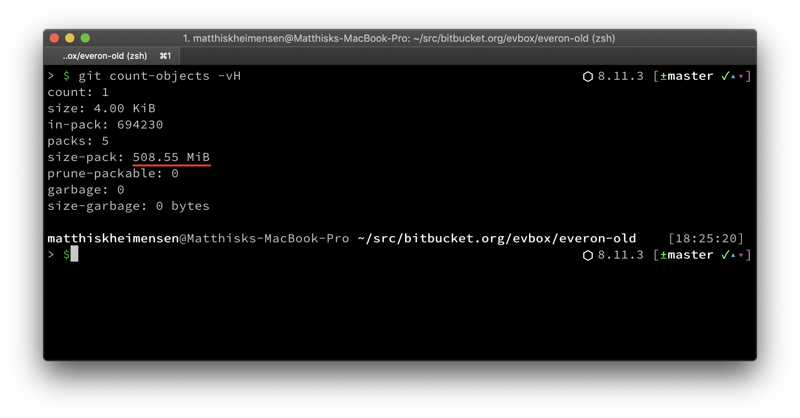
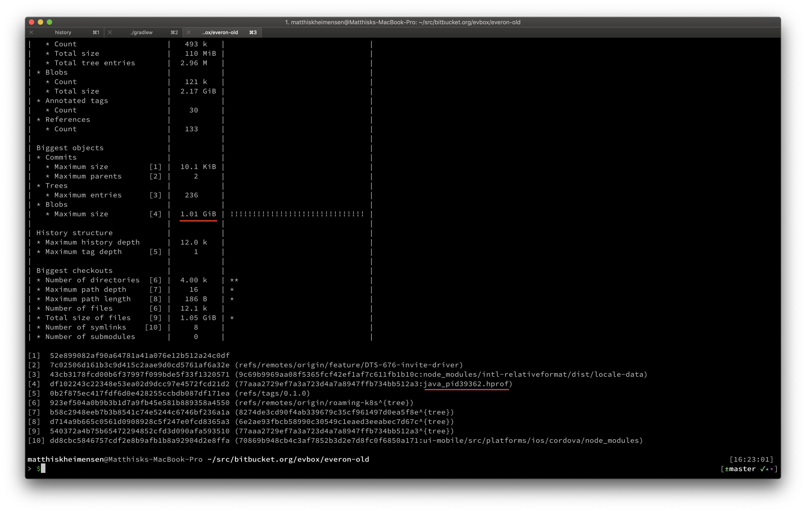
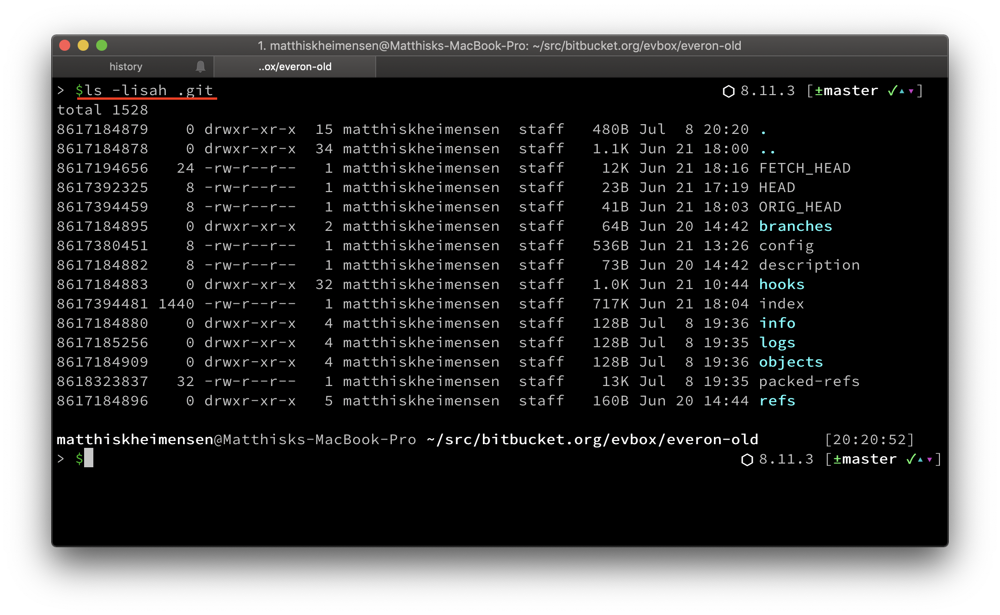

slidenumbers: true
footer: m@tthisk.nl

# Gitting real:
## Rewriting history

---


---

# WHY 😰 !?!

---



---

## It's Huuuuge!

```
> $ du -hs .
    1.7G.
```

---



---

# 🤦‍♀️

---

# Git internals (basics)

---

# Git basics

* All of git's data is stored in `.git` directory

---



---

[.build-lists: true]

# Git basics

* Git is a content adressable file system
* Git objects
  * blobs
  * trees
  * commits
  * tags

---

[.build-lists: true]

# Git basics

* commits reference a tree
* trees reference blobs (and other trees)
* blobs contain file contents

^ show git cat-file command

---

# Git basics

* objects are compressed into pack files
  * objects are sorted by name and then size
  * a sliding window compresses the objects
* result *.idx and *.pack

^ show .git/objects directory

---

# Rewriting history?


^ since the commit hash is based upon the hash of the tree, which is in turn based on hashes of objects, rewriting a file will change the commit hash to change. And since the next commit hash is based on the previous commit hash, this hash will also change, etc. etc.

---

# How do you rewrite history?

* finding large blobs
* finding commits related to large blobs
* cleaning out large blobs
* guarantee that nothing changed on master

---

# Finding large blobs

```bash
$ git ls-tree -r --long master | less
```

```bash
$ git ls-tree -r --long master |\ 
  sort -rnk4 | less
```

```bash
$ git rev-list --all | xargs -L1 git ls-tree -r --long |\
  sort -rnk4 | less
```

---

[.build-lists: true]

# Finding large blobs (faster)

```bash
$ git verify-pack -v .git/objects/pack/pack-******.idx | sort -nk3 | less
```

* How would you find the filename if you have just a hash?
* ```$ git describe HASH```

---

## Finding large blobs (the easy way)

```bash
$ git-sizer -v
```

---

# Cleaning out blob(s)

```bash
$ git filter-branch --force --index-filter "VERY_LONG_COMMAND"
```

---

# Cleaning out blob(s)

```bash
$ bfg --delete-files FILENAME .
```

---

# Guarantee master didn't change

We can hash the master tree and compare it before and after rewriting:

```bash
$ git ls-tree HEAD | git hash-object --stdin
```

---

## Coordination

---

# Experiences

* Coordination is hard!
* Somebody will push up an old pointer (monitor the repo in the days to come) make sure the old pointer doesn't hit master
* Be really sure there is no code relying on commit hashes
* The immutable nature of Git can give you strict guarantees that nothing changed on the master commit, after rewriting history.
* Garbage collection on Github/Bitbucket requires bureaucracy

---

1) Check size of your repository:

`$ git count-objects -vH`

2) Download `git-sizer`[^1] to identify large blobs

[^1]: https://github.com/github/git-sizer

3) Use `bfg-cleaner`[^2] to remove blobs

[^2]: https://rtyley.github.io/bfg-repo-cleaner/

4) ...

5) feel the authority

---