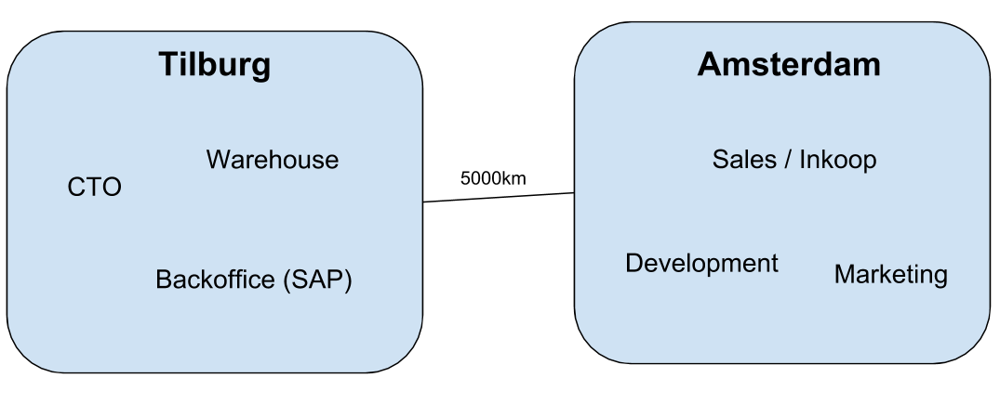
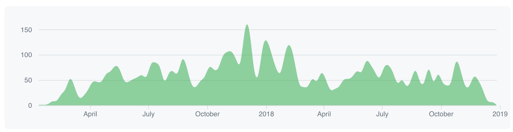
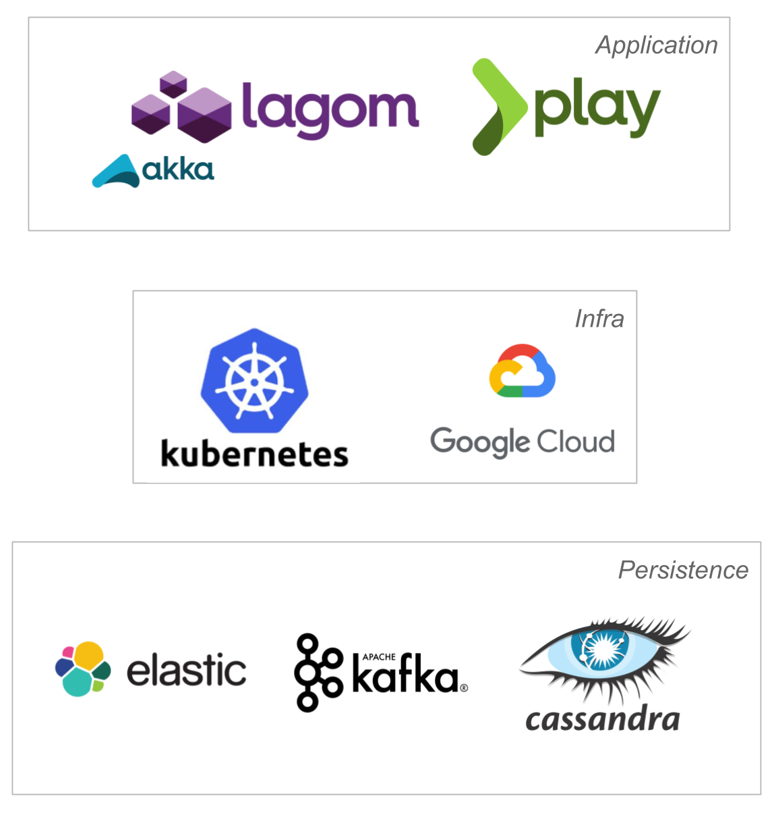
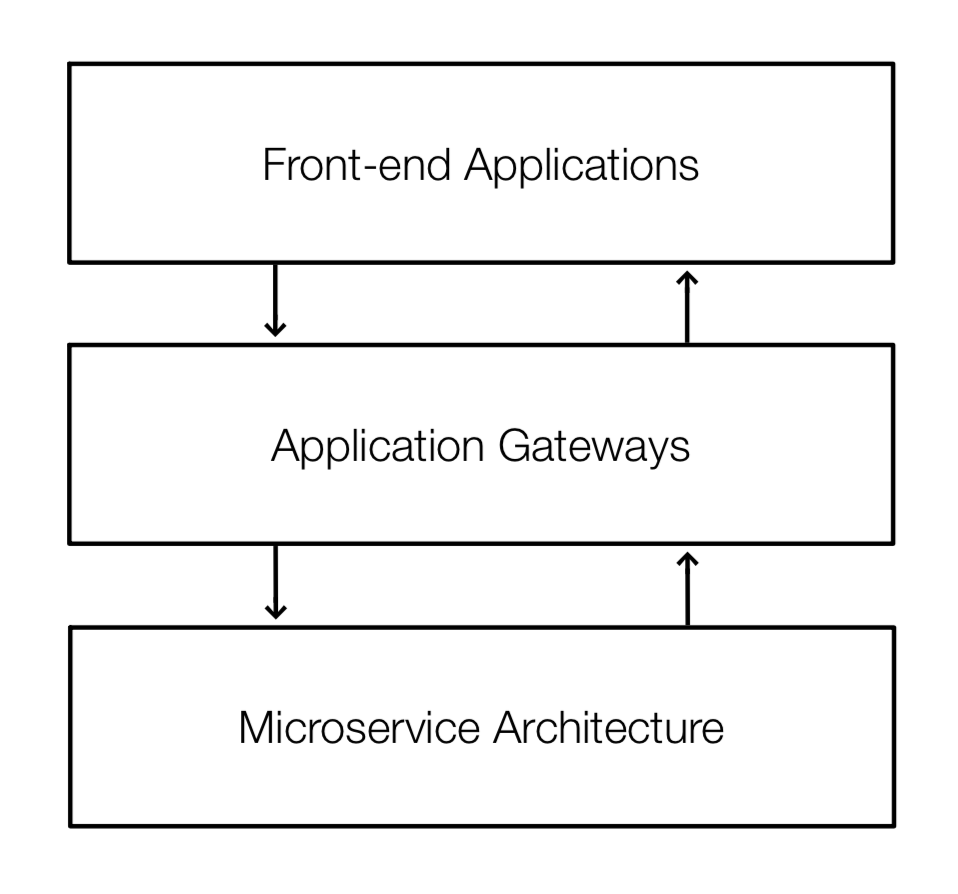
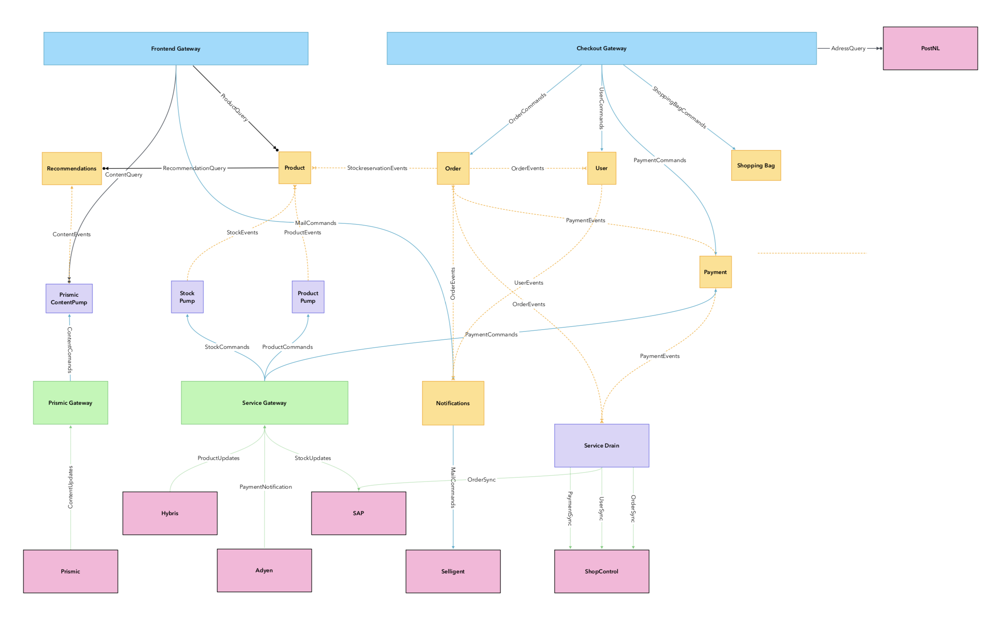

slidenumbers: true

# e-commerce from __A__ to __Z__
### *Xebia* and *The Sting*

---

# Background of the project

* Running legacy Hybris (*old old version*)
* Maintained by integrator which employs __30__ people on the project
* Road to production > __30 days__
* __1 store__ + copy pasta `===` __another store__
* Without being able to handle trivial load

^ this is a classic hybris instance, unmaintainable unupgradable

<!-- 
Hybris platform build by very unskilled cheap laborers build the platform, you can imagine what happened.
It was immensly expensive to run this platform, think 1.000.000 million plus a year.
Then they quoted a 400.000 euro price for adding a new gender to the Costes store
Then Gideon started an audit of the then current solution.
-->

---

# Scope of the project

* Multi brand from a single codebase
* Multi language
* Product discovery (core shopping)
* Content management (promotional content)
* Ordering and payment (checkout)
* Integrations with external systems

---

# Team

Consists of +- **8** developers, where half are **frontend** and the other half are **backend** developers

---

# Xebia consultants

**Gideon de Kok** (back-end), **Ruben Oostinga** (front-end), **Mike Woudenberg** (front-end?), **Jesse van Bekkum** (back-end), **Norbert de Lange** (front-end), **Anton Lijcklama** (back-end), **Cengiz Ulusoy** (front-end / UX), **Khrystyna Svarok** (front-end), **Michael Meiers** (product owner), **Frank Visser** (back-end), **Joachim Bargsten** (back-end)[^1]

[^1]: missing someone? :sweat_smile:

---

# Challenges

* Build an in house e-commerce platform with __tiny__ team
* For a company that wants to sell clothes from a __table__ not an __iphone__
* While decreasing their **marketing budget**
* Without any (serious) **UX** expertise in-house

^ Another challenge being that after a couple of months all knowledge of the old platform was gone

---

# Organization



---

#Timeline



---

# Project Timeline

__Core Shopping Costes__ - march 2017 - december 2017

__Core Shopping The Sting__ - january 2018 - may 2018

__Checkout Costes__ - january 2018 - october 2018

__Checkout The Sting__ - october 2018 - january 2019

---

# 🍾 Going live 🍾

<br/>

As of today  both **core shopping** and **checkout** have been delivered for all **Sting brands**

^ potentially give a short demo, if there is enough time

---

# Technology Stack

^ Focussing on backend, since there was already once a session on the frontend

---



---

# Deliverables

* _10.000+_ __commits__ 
* _2000+_ __pull requests__

```
-------------------------------------------------------------------------------
Language                     files          blank        comment           code
-------------------------------------------------------------------------------
Java                           389           7867            629          39355
JSX                            536           4101            395          35985
JavaScript                     321           2936            398          29870
YAML                            77            205            171           5531
-------------------------------------------------------------------------------
```

---

# Architecture

* Layered architecture
* Event sourced persistence
* Read optimized storage through CQRS

---



---



---

# Architecture
#### Where it shines

* Nearly no changes to *out-of-scope* services
* Events can easily be propagated to *external services*
* Free *audit trails*

^ Demo event sourcing

---

# Architecture
#### Where it hurts

* __event sourcing__ is hard to debug
* Consistency in an __in-consistent__ world
* Mapping, mapping and mapping...
* Maintainability over development speed

---

[.build-lists: true]

## Classic Issues

* CI on a monorepo 😭
* Running the micro services landscape locally ♨️
* Clusters are hard 🧐
* Choosing service boundaries 👉|👈
* Building the distributed monolith 🎭
* Keeping dependencies up-to-date 🌱

^ Demo circle CI

---

# Results

* 😁 Happy Customer!
* Reduced **running costs**, a lot 💰
* Platform that can handle traffic

---

<!--# Technical victories

* **Jenkins** to **CircleCI**
* **maven** to **SBT**
* **manual** release process to a **click of a button** release
* from **insane** to **sane** k8s configuration

----->

# Retrospect 

* Adyen will **screw you** at one point 💸
* Don't build integrations without documentation 📑
* __Small bang__ can be smaller 🤯

---

# The Future

* Autonomy
* Continuity
* Vision